                                        Resultado Actividad 5

(a causa de un error al borar un README.md que contenia el paso a paso, adjuntos capturas del resultado de la actividad 5)

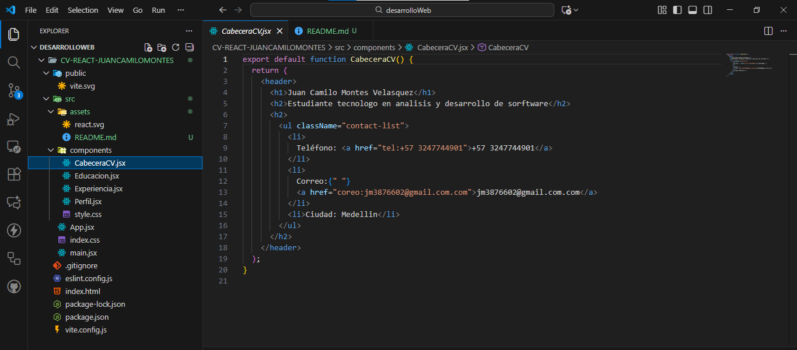
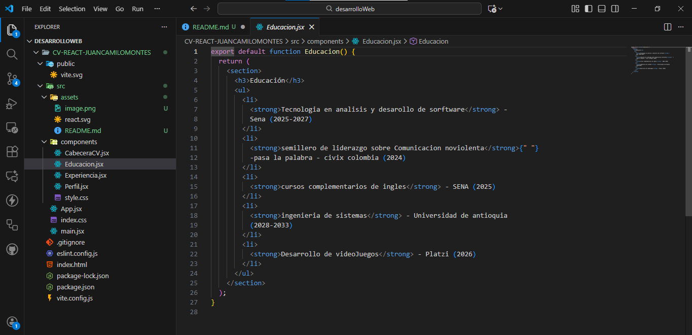
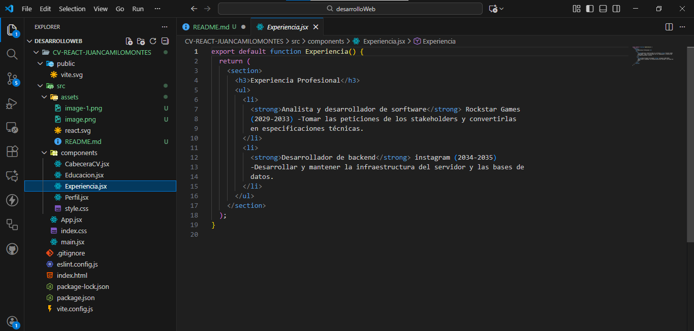
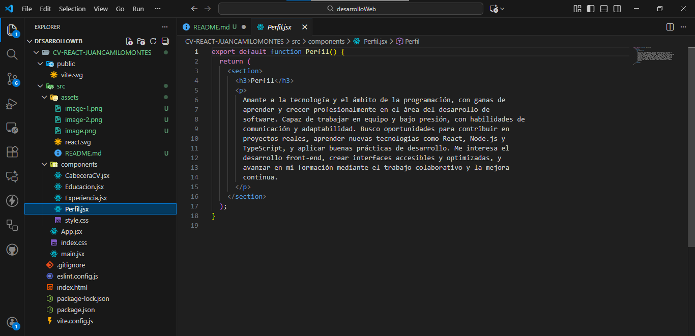
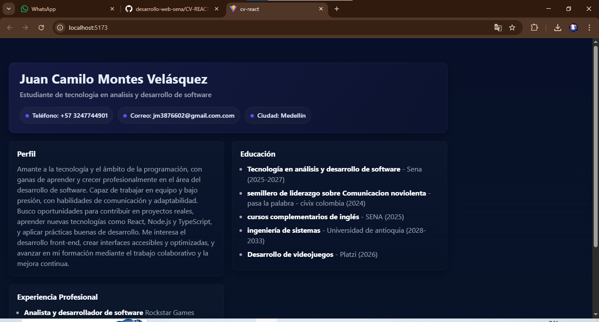

                                        Resultado Actividad 6

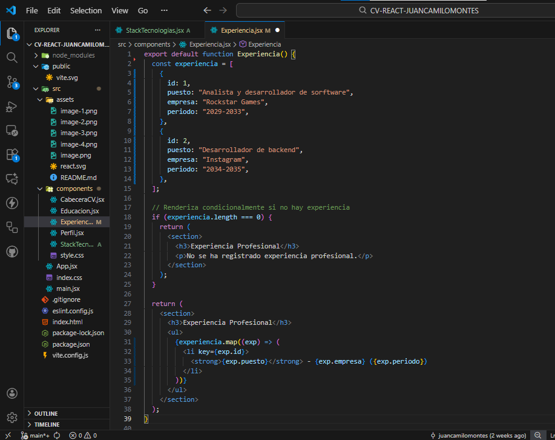
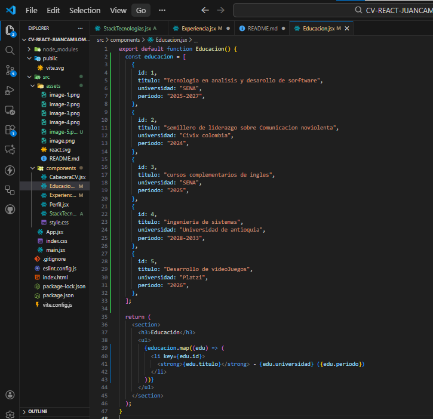
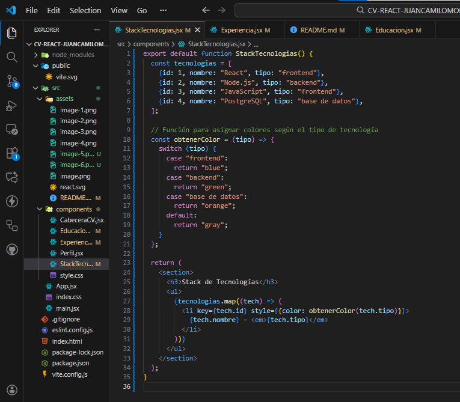
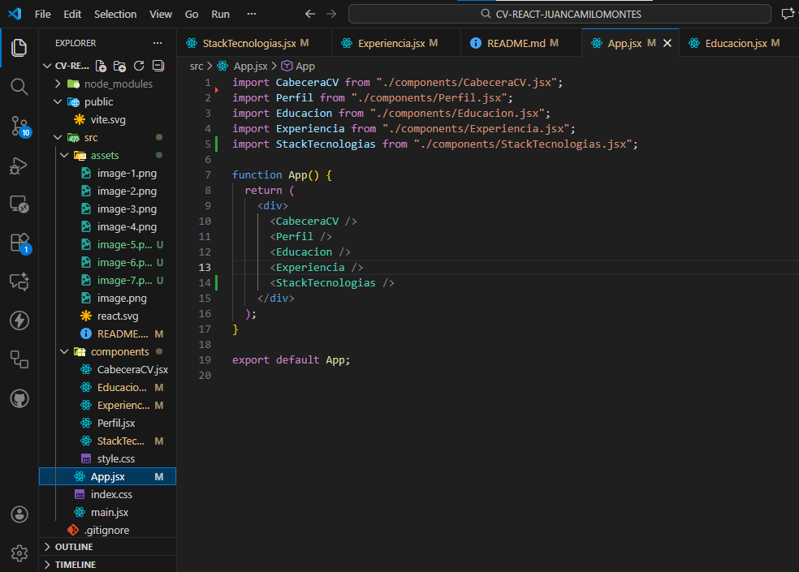
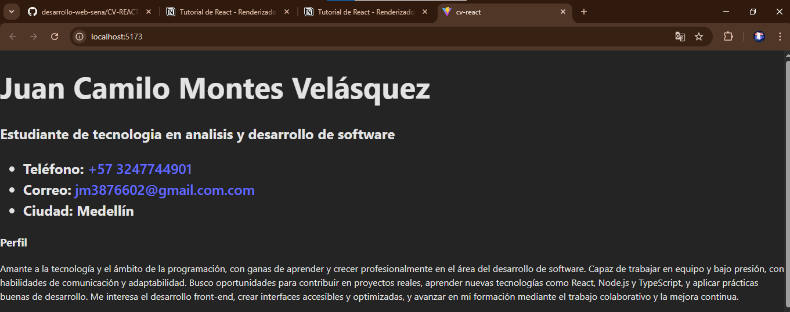
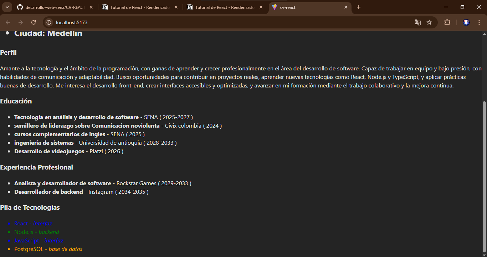

                                        Resultado Actividad 7

Este proyecto utiliza props y desestructuración para renderizar un CV dinámico.

Componentes:

- CabeceraCV: recibe nombre, cargo, ciudad, contacto
- Perfil: recibe resumen
- Experiencia: recibe arreglo de experiencias
- Educación: recibe arreglo de estudios

Los datos se almacenan en App.jsx como constantes y se pasan mediante props.

Los props en React son datos que un componente padre le envía a un componente hijo. Permiten que los componentes sean reutilizables y dinámicos. En mi proyecto de CV, App.jsx envía los datos personales, el perfil, las experiencias y la educación a cada componente. Los componentes reciben estos datos mediante desestructuración de props para poder mostrarlos en pantalla.

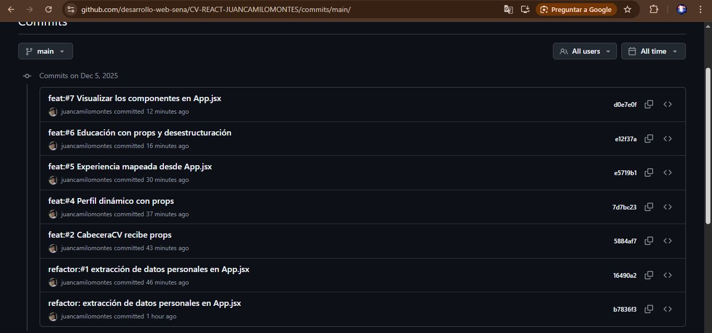
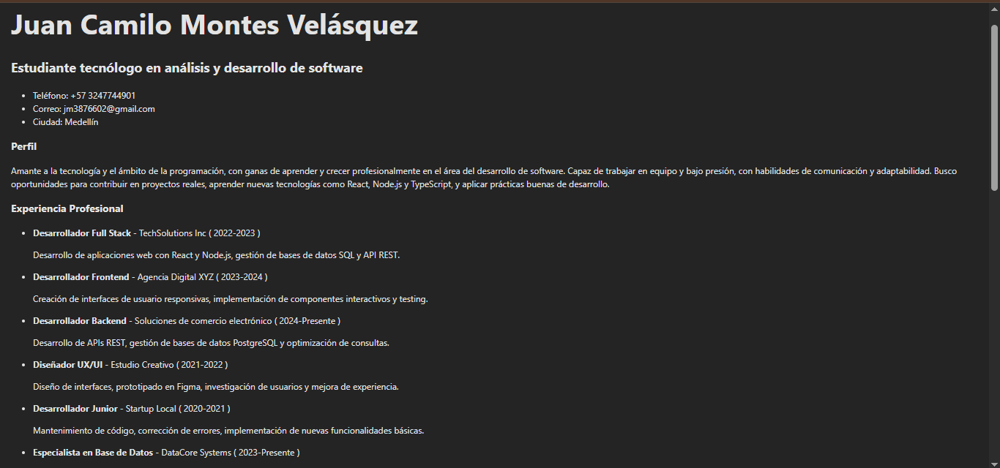
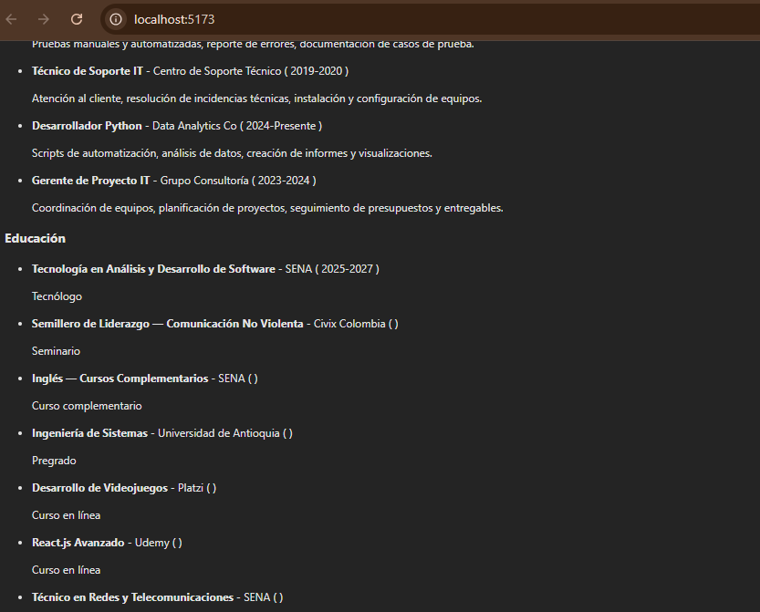
